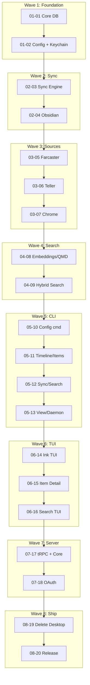
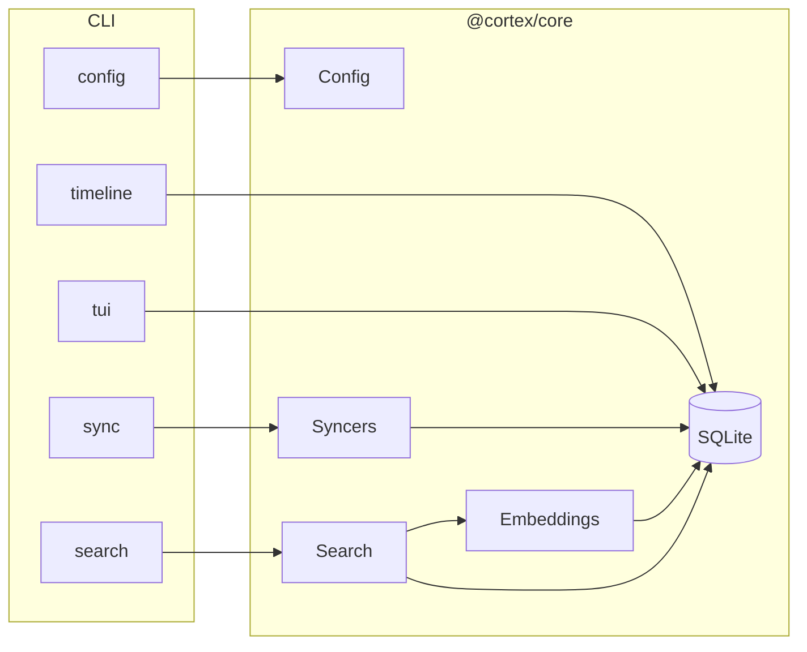

# Cortex Rewrite: CLI-First Architecture

## What This Is

Migration from **Electron desktop app** → **CLI-first** personal OS. Same data (Obsidian, Farcaster, Teller, Chrome), new interface.

## The Plan (8 Phases, 20 Plans)



| Phase | Status | What |
|-------|--------|------|
| 01 Core | ✅ Done (prior) | SQLite, config, keychain |
| 02 Sync | ✅ Done (prior) | Sync engine + Obsidian |
| 03 Sources | ✅ Done (prior) | Farcaster, Teller, Chrome |
| 04 Embeddings | ✅ **This PR** | QMD integration, hybrid search |
| 05 CLI | ✅ **This PR** | config, timeline, items, sync, search, view, daemon, embed |
| 06 TUI | ✅ **This PR** | Ink-based interactive UI |
| 07 Server | ⏸️ Deferred | Refactor to use @cortex/core |
| 08 Cleanup | ✅ **This PR** | Delete desktop, update docs |

## What Changed in This PR

- **Added** `packages/core/embeddings` – QMD client, auto-embed after sync
- **Added** `packages/core/search` – semantic + full-text hybrid search
- **Added** `apps/cli` – full CLI with 9 commands + TUI
- **Removed** `apps/desktop` – Electron app
- **Updated** README, package.json scripts

## Architecture (Simple)



## How to Test

**Requires Bun** (core uses `bun:sqlite`).

```bash
bun install
bun run build

cd apps/cli

# Smoke test
bun run dist/bin/run.js --help
bun run dist/bin/run.js config
bun run dist/bin/run.js timeline
bun run dist/bin/run.js search "test"

# With data - configure Obsidian then:
bun run dist/bin/run.js config --set 'sources.obsidian={"type":"obsidian","enabled":true,"config":{"vaultPath":"/path/to/vault"}}'
bun run dist/bin/run.js sync -s obsidian
bun run dist/bin/run.js timeline

# TUI (q to quit)
bun run dist/bin/run.js tui
```

## What It Means

- **No more Electron** – lighter, faster, terminal-native
- **CLI-first** – scripts, automation, `--json` for agents
- **TUI** – `cortex tui` for interactive browsing
- **Same data** – Obsidian, Farcaster, Teller, Chrome sync unchanged
- **Search** – semantic (QMD) + full-text, works without QMD (fallback)
