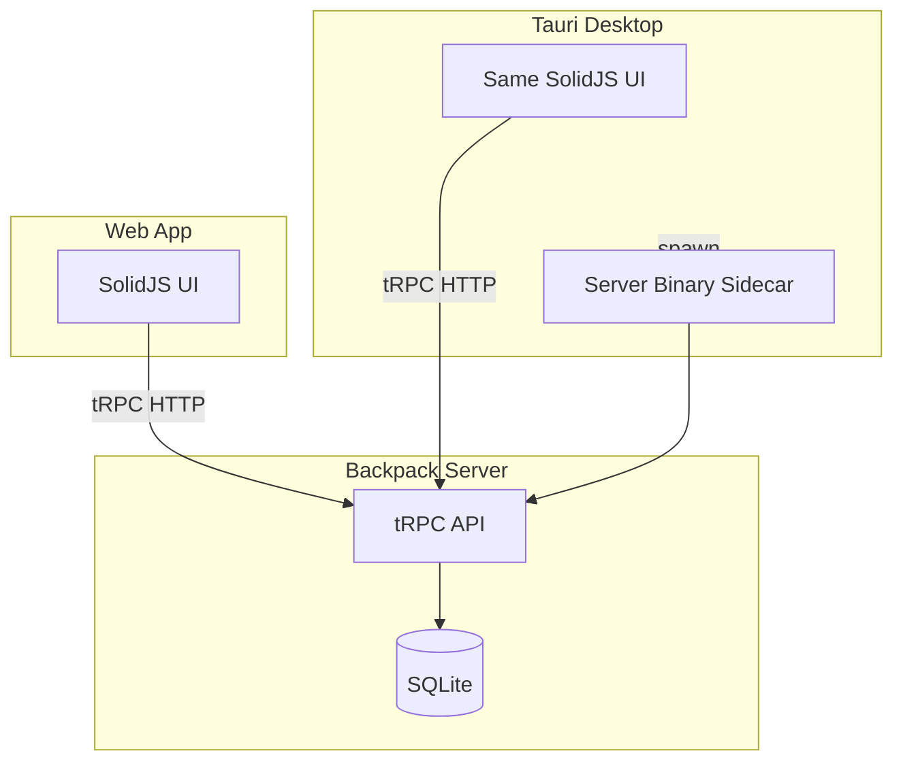
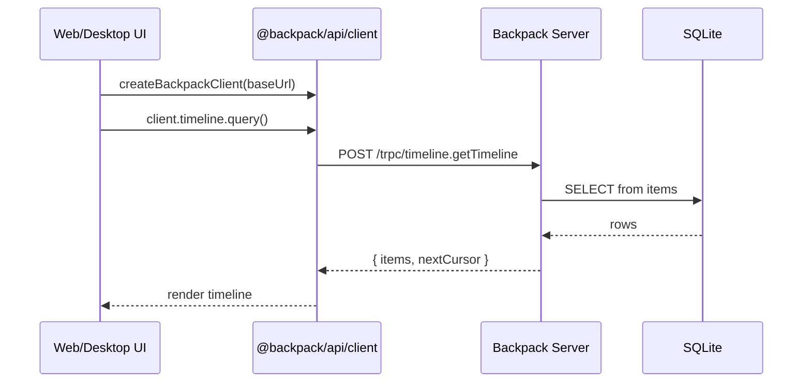
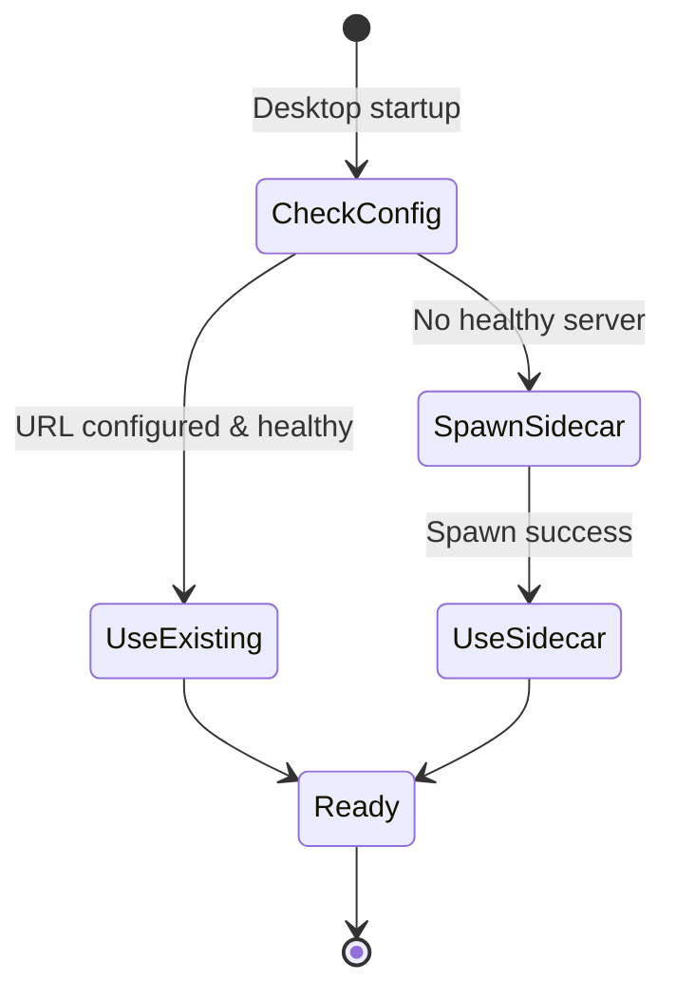

# Web + Desktop Apps: Comprehensive Planning Document

> **Created:** February 2026  
> **Status:** Planning  
> **Scope:** SolidJS web app + Tauri desktop app with shared UI, SDK/API client, server bundling (opencode-style), OAuth, vault creation
>
> **See also:** [Cursor Plan - Web Desktop SolidJS Tauri](/Users/dylansteck/.cursor/plans/web_desktop_solidjs_tauri_82a62d90.plan.md) for the implementation checklist and architecture overview.

---

## Table of Contents

1. [Executive Summary](#1-executive-summary)
2. [Research Sources & Citations](#2-research-sources--citations)
3. [Clarifying Questions & Answers](#3-clarifying-questions--answers)
4. [Architecture Deep Dive](#4-architecture-deep-dive)
5. [Opencode Pattern Analysis](#5-opencode-pattern-analysis)
6. [SolidJS + Tauri Technical Research](#6-solidjs--tauri-technical-research)
7. [Backend Gaps & API Design](#7-backend-gaps--api-design)
8. [OAuth Flow Design](#8-oauth-flow-design)
9. [Vault Creation Matrix](#9-vault-creation-matrix)
10. [Component & UI Breakdown](#10-component--ui-breakdown)
11. [Implementation Order & Tasks](#11-implementation-order--tasks)
12. [Migration & Compatibility Notes](#12-migration--compatibility-notes)
13. [Open Questions & Follow-ups](#13-open-questions--follow-ups)
14. [VM Deployment and Install](#14-vm-deployment-and-install)

---

## 1. Executive Summary

Add two new apps to the Backpack monorepo:

- **Web** (`apps/web`): SolidJS + Vite SPA for timeline, connection management, settings
- **Desktop** (`apps/desktop`): Tauri v2 wrapping the same UI, with optional server sidecar

**Shared UI:** 100% code shared between web and desktop. Both use tRPC API client; no direct DB access.

**Server flexibility:** Server can run standalone, be bundled as desktop sidecar (opencode pattern), or (future) deployed to cloud.

**Primary flows:** OAuth pass-through (Teller), vault creation (Obsidian), timeline + connection management.

### Decision Rationale Summary

| Decision | Rationale |
|----------|-----------|
| **SolidJS** | Opencode validates it; 1.11x vanilla perf, 7kb; fine-grained reactivity; no VDOM |
| **Vite** | Tauri native support; faster than Next.js for SPA; no SSR overhead for desktop |
| **tRPC client** | Backpack already uses tRPC; no OpenAPI generation needed; simpler than opencode's approach |
| **Shared UI** | Single codebase; web + desktop identical; PlatformProvider for platform-specific behavior |
| **Server sidecar** | Opencode pattern; flexibility: standalone or bundled; user can run server separately |
| **Desktop = vault primary** | Web can't access local files; folder picker only in Tauri; keeps web simple |

---

## 2. Research Sources & Citations

### 2.1 DeepWiki (anomalyco/opencode)

| Topic | URL | Key Finding |
|-------|-----|--------------|
| **Desktop server management** | [DeepWiki: How does the desktop app start and manage the server?](https://deepwiki.com/search/how-does-the-desktop-app-start_78eebd90-00ff-468a-a968-a1ed2bc57c8e) | Desktop embeds `opencode-cli` as sidecar; spawns if no healthy server found; `setup_server_connection` in `packages/desktop/src-tauri/src/lib.rs` |
| **SDK/client architecture** | [DeepWiki: SDK package structure](https://deepwiki.com/search/what-is-the-structure-of-the-s_458d5295-297e-451d-9154-c06e9185420e) | `@opencode-ai/sdk` has client/server exports; `createOpencodeClient` from OpenAPI spec; `createClient` from `@hey-api/openapi-ts` |
| **Shared UI code** | [DeepWiki: Tauri desktop app share UI](https://deepwiki.com/search/how-does-the-tauri-desktop-app_3d7527f7-8978-48db-9f17-3ae906457f8e) | `@opencode-ai/app` + `@opencode-ai/ui` packages; Tauri uses `frontendDist: "../dist"`; `PlatformProvider` for platform-specific behavior |
| **ServerGate component** | Same | `awaitInitialization` command; frontend waits before rendering main UI |

### 2.2 Exa / Web Search

| Topic | Source | Key Finding |
|-------|--------|--------------|
| **SolidJS + tRPC** | [SolidStart Docs - API routes](https://docs.solidjs.com/solid-start/building-your-application/api-routes) | tRPC fetch adapter; `createTRPCProxyClient` + `httpBatchLink` to `/api/trpc` |
| **tRPC + SolidJS** | [juliusmarminge/trpc-solid](https://github.com/juliusmarminge/trpc-solid) | Minimal example with fetch adapter + Solid Query |
| **Tauri sidecar** | [Tauri v2 - Embedding External Binaries](https://v2.tauri.app/develop/sidecar/) | `externalBin` in `tauri.conf.json`; `app.shell().sidecar(name)` to spawn |
| **Tauri OAuth** | [Deep linking in Tauri - OAuth use case](https://mrlaude.com/articles/deep-linking-in-tauri-an-o-auth-use-case/) | `tauri-plugin-deep-link` for redirect; custom scheme for callback |
| **Tauri OAuth** | [Supabase + Google OAuth in Tauri 2.0](https://medium.com/@nathancovey/supabase-google-oauth-in-a-tauri-2-0-macos-app-with-deep-links-f8876375cb0a) | PKCE flow; `detectSessionInUrl`; deep links for callback |
| **Tauri OAuth** | [Implementing OAuth in Tauri](https://medium.com/@Joshua_50036/implementing-oauth-in-tauri-3c12c3375e04) | `tauri-plugin-oauth`; `reqwest` + `url` for token exchange |

### 2.3 Opencode GitHub Issues

| Issue | URL | Key Finding |
|-------|-----|-------------|
| **Desktop spawn failure** | [#8233](https://github.com/anomalyco/opencode/issues/8233) | Desktop spawns OpenCode server; `opencode serve --port 0`; failure modes captured |
| **WSL backend** | [#5635](https://github.com/anomalyco/opencode/issues/5635) | `spawn_sidecar()` always uses native binary; WSL option discussed |
| **Web-only dev** | [#10160](https://github.com/anomalyco/opencode/issues/10160) | `isTauri` guard needed; `invoke("ensure_server_ready")` must be conditional |
| **AppImage sidecar** | [#7612](https://github.com/anomalyco/opencode/issues/7612) | Sidecar path resolution; `APPDIR` for bundled binaries |

### 2.4 Backpack Codebase Internal

| File | Purpose |
|------|---------|
| `packages/sdk/src/backpack.ts` | SDK uses `@backpack/db` directly; no HTTP client |
| `packages/sdk/src/obsidian.ts` | `getObsidianVaultPath()` from DB; `connectionMetadata.localPath` |
| `packages/api/src/routers/mcp.ts` | `connectChrome`, `connectBrave` pattern; no `connectObsidian` |
| `packages/api/src/routers/timeline.ts` | Farcaster, Teller, user notes; no Obsidian items |
| `apps/server/src/index.ts` | Elysia + tRPC at `/trpc/*`; `/api/init-database` |
| `apps/server/package.json` | `compile`: `bun build --compile ... --outfile server` |
| `packages/db/src/seed.ts` | Obsidian: `connectionType: "local"` |

### 2.5 Research Report (User-Provided)

| Topic | Source | Key Finding |
|-------|--------|-------------|
| **Opencode stack** | [@thdxr on opencode SolidJS](https://x.com/i/status/2000584053712429456) | SolidJS across TUI, Tauri, SolidStart web, enterprise |
| **SolidJS perf** | [SolidJS Official](https://www.solidjs.com/) | 1.11x vanilla speed; 7kb gzip; real DOM updates |
| **Tauri resources** | [@Sameerjs6](https://x.com/i/status/2018785929776013623) | Tauri ~3–5MB vs Electron 200MB+ |
| **opencode-web** | [bjesus/opencode-web](https://github.com/bjesus/opencode-web) | SolidJS + Vite + Tailwind + DaisyUI; virtual scrolling |
| **tauri-start-solid** | [riipandi/tauri-start-solid](https://github.com/riipandi/tauri-start-solid) | Tauri v2 + SolidJS + Tailwind + Nano Stores |
| **Vite vs Next.js** | [Tauri Vite Guide](https://tauri.app/start/frontend/vite) | Vite native for Tauri; Next.js bloats desktop SPAs |

---

## 3. Clarifying Questions & Answers

### Q1: Where does the Backpack server run?

**Answer:** Server should be startable on its own, but also bundled into desktop. Opencode-style flexibility: server is its own entity; SDK can start/manage it; can be bundled into desktop. Local for now; cloud possible later.

### Q2: How should "create vault" work on web? (Web cannot access local files.)

**Answer:** Maybe explicit path input if server runs locally. If that's a bottleneck, server handles it or user uses desktop/CLI. Use this work to rewire/rethink vault creation.

### Q3: Which OAuth flows?

**Answer:** Mainly Teller (needs web page). Design neutral/simple for future providers.

### Q4: SDK vs API client?

**Answer:** Web and desktop call the API directly. Look at opencode for inspiration—they have good primitives.

**Implementation decision:** Consolidate into `@backpack/api/client` instead of a separate `packages/api-client`. The client lives at `packages/api/src/client.ts` and is exported as `@backpack/api/client`. This avoids an extra package; the client only imports the `AppRouter` type (type-only, no runtime server code) and `@trpc/client`.

### Q5: Initial UI scope?

**Answer:** Timeline + manager of connections and settings. Really clean design.

---

## 4. Architecture Deep Dive

### 4.1 System Diagram



### 4.2 Data Flow



### 4.3 Server Lifecycle



---

## 5. Opencode Pattern Analysis

### 5.1 Desktop Server Management

- **Sidecar binary:** `opencode-cli` embedded via `externalBin`
- **Startup logic:** `setup_server_connection` in `lib.rs`
  - Try custom URL if configured
  - Check healthy local server on default port
  - If none: spawn sidecar with `serve --port=PORT`
- **Frontend:** `awaitInitialization` Tauri command; `ServerGate` waits before rendering

### 5.2 SDK Client

- **OpenAPI:** Server exposes OpenAPI spec; `@hey-api/openapi-ts` generates client
- **createOpencodeClient:** Accepts `baseUrl`, optional `fetch`, optional `directory` (for `x-opencode-directory` header)
- **Backpack difference:** We use tRPC; no OpenAPI. Simpler: `createTRPCProxyClient` + `httpBatchLink`

### 5.3 Shared UI

- **Packages:** `@opencode-ai/app` (core), `@opencode-ai/ui` (components)
- **Desktop:** `frontendDist: "../dist"`; `publicDir: "../app/public"`
- **PlatformProvider:** Context for `openLink`, `notify`, file pickers—different impl for web vs desktop

### 5.4 Lessons Applied

| Opencode | Backpack |
|----------|--------|
| Server as sidecar | Bundle `server` binary; spawn if needed |
| ServerGate for init | Wait for server before main UI |
| SDK with baseUrl | @backpack/api/client with baseUrl |
| PlatformProvider | `isTauri` checks; Tauri dialog for folder picker |

---

## 5.5 Learning from Research Report

The user-provided research report (Opencode + SolidJS + Tauri) yielded:

- **Framework choice:** SolidJS chosen for fine-grained reactivity, 1.11x vanilla speed, 7kb gzip. Opencode uses it across TUI, Tauri, web.
- **Bundler:** Vite over Next.js for Tauri—native support, smaller bundles, SPA focus. Next.js adds SSR overhead not needed for desktop.
- **Shared UI:** Same codebase for web and desktop; Tauri loads built assets via `frontendDist`.
- **OAuth in Tauri:** Use system browser or deep-link; avoid webview for OAuth (blocked by some providers).
- **Safari caveat:** Opencode notes Safari sticky positioning perf issues; test on WebKit.

---

## 6. SolidJS + Tauri Technical Research

### 6.1 SolidJS Benefits (from research)

- **Performance:** 1.11x vanilla speed, 7kb gzip (vs React 1.61x, 40kb+)
- **Reactivity:** Fine-grained signals; no VDOM
- **DX:** `createSignal`, `createResource`; `class` not `className`

### 6.2 Tauri + SolidJS Setup

- **Template:** `tauri-start-solid` (riipandi) or `create-tauri-app` with SolidJS
- **Vite config:** `vite-plugin-solid`, `@tailwindcss/vite`; `TAURI_HOST` for HMR
- **Shared build:** Same Vite config; web: `dist/` for static; desktop: `frontendDist`

### 6.3 OAuth in Tauri Webview

- **Problem:** Webview blocked by some OAuth providers; phishing risk
- **Solution:** Open system browser via `@tauri-apps/plugin-shell` → `open(authUrl)`
- **Callback:** localhost or custom scheme (`backpack://`); `tauri-plugin-deep-link` for redirect

### 6.4 Tailwind + SolidJS

- **Tailwind v4:** `@import "tailwindcss"`; `@tailwindcss/vite` plugin
- **SolidJS:** Use `class`, not `className`

---

## 7. Backend Gaps & API Design

### 7.1 Missing tRPC Procedures

| Procedure | Location | Purpose |
|-----------|----------|---------|
| `connectObsidian` | `appsRouter` (mcp.ts) | Add/update connection with `vaultPath` in `connectionMetadata` |
| `obsidian.listNotes` | New `obsidianRouter` | List notes from vault (server-side; uses connection metadata) |
| `obsidian.readNote` | Same | Read note content |
| `obsidian.createNote` | Same | Create note (optional for v1) |

### 7.2 Timeline + Obsidian

- **Current:** `getTimeline` fetches Farcaster, Teller, user notes. Obsidian items exist in `items` table when synced.
- **Gap:** Add branch for `connection.serverId === "obsidian"`; fetch from `items` where `source=obsidian`, `type=note`.

### 7.3 connectObsidian Implementation

```ts
// packages/api/src/routers/mcp.ts
connectObsidian: publicProcedure
  .input(z.object({ appId: z.string(), vaultPath: z.string() }))
  .mutation(async ({ input }) => {
    const db = getDatabase();
    const app = await db.select().from(apps).where(eq(apps.id, input.appId)).limit(1);
    const appName = app[0]?.name || input.appId;
    const existing = await db.select().from(connections).where(eq(connections.serverId, input.appId)).limit(1);
    const connectionData = {
      serverId: input.appId,
      serverName: appName,
      transportType: "http" as const,
      transportConfig: {},
      status: "connected" as const,
      connectionMetadata: { localPath: input.vaultPath },
      // ... rest same as connectChrome
    };
    if (existing.length > 0) { /* update */ } else { /* insert */ }
  })
```

### 7.4 Obsidian Router Logic

- Reuse logic from `apps/server/src/tools/obsidian.ts` and `packages/sdk/src/obsidian.ts`
- Get vault path from `connections` where `serverId === "obsidian"`
- Server runs on same machine as vault; path is valid for server process

---

## 8. OAuth Flow Design

### 8.1 Teller (Existing)

- **Server:** `/teller/connect` (HTML + Teller Connect SDK), `/teller/callback`
- **Flow:** Redirect to connect → user authenticates → callback → `saveTellerToken` tRPC

### 8.2 Web

- **Initiate:** `window.location.href = serverUrl + '/teller/connect'`
- **Callback:** Server handles; redirect to app with success/error

### 8.3 Desktop

- **Initiate:** `window.__TAURI__.shell.open(serverUrl + '/teller/connect')`
- **Callback:** Server must be reachable; callback URL: `http://localhost:3000/teller/callback` (or server's configured origin)
- **Alternative:** Use `customProtocol` with `backpack://callback?code=...`; deep-link plugin to capture

### 8.4 Design Principles

- OAuth logic server-side only
- Frontend: initiate (navigate/open) + display status
- Neutral for future providers (Farcaster, MCP OAuth)

---

## 9. Vault Creation Matrix

| Platform | Flow | Notes |
|----------|------|-------|
| **Desktop** | Native folder picker → `connectObsidian(appId, path)` | Primary UX |
| **Web** | Optional: manual path input (server local) | Path = server filesystem; or "Use Desktop for vault" |
| **CLI** | `backpack config --set sources.obsidian.config.vaultPath=/path` | Existing |

**Recommendation:** Desktop = primary. Web shows "Connect via Desktop" for Obsidian if no connection.

---

## 10. Component & UI Breakdown

### 10.1 packages/ui Exports

| Component | Purpose |
|-----------|---------|
| `ServerGate` | Waits for server; shows loading/error |
| `Layout` | Shell: nav, header |
| `Timeline` | List of timeline items; source filter |
| `ConnectionCard` | App card + connect/disconnect |
| `Settings` | Server URL, theme (future) |
| `VaultPicker` | Desktop-only: folder picker → connectObsidian |

### 10.2 Platform Detection

```ts
export const isTauri = () => typeof window !== 'undefined' && !!window.__TAURI__;
```

### 10.3 Design Direction

- Clean, minimal
- Tailwind v4; no shadcn initially
- Consider Kobalte or Solid-UI for accessible primitives later

### 10.4 Monorepo Workspace Config

```yaml
# pnpm-workspace.yaml (or bun workspaces in package.json)
packages:
  - "apps/*"
  - "packages/*"
```

```json
// Root package.json scripts
{
  "dev:web": "turbo -F web dev",
  "dev:desktop": "turbo -F desktop dev",
  "build:web": "turbo -F web build",
  "build:desktop": "turbo -F desktop build",
  "dev:all": "turbo dev"
}
```

### 10.5 Vite Config (Shared / Web)

```ts
// apps/web/vite.config.ts
import { defineConfig } from 'vite';
import solid from 'vite-plugin-solid';
import tailwindcss from '@tailwindcss/vite';

export default defineConfig({
  plugins: [solid(), tailwindcss()],
  server: { port: 5173, strictPort: true },
  build: { target: 'esnext', outDir: 'dist' },
});
```

### 10.6 Tauri Config Snippet

```json
// apps/desktop/src-tauri/tauri.conf.json
{
  "build": {
    "beforeDevCommand": "pnpm run build",
    "devUrl": "http://localhost:5173",
    "beforeBuildCommand": "pnpm run build",
    "frontendDist": "../web/dist"
  },
  "bundle": {
    "externalBin": ["server"]
  }
}
```

---

## 11. Implementation Order & Tasks

### Phase 1: API Client

1. Add `@backpack/api/client` (in packages/api - no separate api-client package)
2. `createBackpackClient(baseUrl)` with tRPC
3. Export types from `@backpack/api`

### Phase 2: Backend Gaps

4. Add `connectObsidian` to appsRouter
5. Create `obsidianRouter` (listNotes, readNote)
6. Add Obsidian to timeline `getTimeline`

### Phase 3: Shared UI

7. Create `packages/ui` with SolidJS + Tailwind
8. ServerGate, Layout, ConnectionCard, Timeline shell

### Phase 4: Web App

9. Create `apps/web` (Vite + SolidJS)
10. Routes: `/`, `/connections`, `/settings`
11. Wire @backpack/api/client

### Phase 5: Desktop App

12. Create `apps/desktop` (Tauri init)
13. Shared frontend (or build from web)
14. Sidecar config for `server` binary

### Phase 6: Server Spawn

15. Rust: health check, spawn sidecar
16. Tauri commands: `getServerUrl`, `ensureServerReady`

### Phase 7: OAuth & Vault

17. Teller pass-through (web + desktop)
18. Desktop folder picker + connectObsidian

### Phase 8: Polish

19. Error states, loading, settings
20. Clean UI pass

---

## 12. Migration & Compatibility Notes

- **DB:** No schema changes for web/desktop. Existing `connections`, `items`, `apps`.
- **Config:** Server uses `DATABASE_PATH`; desktop sidecar inherits or uses default.
- **Keychain:** Server stores credentials; no client-side keychain needed. OAuth tokens stay server-side.

---

## 13. Open Questions & Follow-ups

1. **Server port:** Fixed (3000) or dynamic? Opencode uses `--port 0` for random.
2. **Database path for sidecar:** Same as standalone? Or app-specific path?
3. **Web deployment:** Vercel/Netlify static; user configures server URL. How to discover local server?
4. **Obsidian createNote:** Include in v1 or defer?
5. **Deep-link vs localhost callback:** For Teller on desktop, which is better?

---

## 14. VM Deployment and Install

Inspired by [opencode](https://opencode.ai)'s VM hosting flow: one-command install, single serve command, and clear deployment docs.

### What Opencode Does

1. **Curl install**: `curl -fsSL https://opencode.ai/install | bash` – detects OS/arch, downloads binary, installs to `~/bin`
2. **Serve command**: `opencode serve` – headless HTTP server with `--hostname 0.0.0.0`, `--cors`, `--mdns`
3. **Auth**: `OPENCODE_SERVER_PASSWORD` for exposed servers
4. **Package managers**: npm, Homebrew, Scoop, Chocolatey, Docker

**Typical VM flow**: `curl ... | bash` → `opencode serve --hostname 0.0.0.0` → done.

### Backpack Implementation

| Capability | Backpack |
|------------|--------|
| **HOST env** | `HOST=0.0.0.0` binds all interfaces ([apps/server/src/index.ts](apps/server/src/index.ts)) |
| **PORT env** | `PORT=3000` (default) |
| **CORS_ORIGIN** | Comma-separated origins for web app |
| **Deploy docs** | [README.md](../README.md#deploy-to-vm-self-host) |

### Deploy to VM (Self-Host)

```bash
# 1. Clone and build
git clone <repo> && cd backpack
bun install && bun run build

# 2. Compile server binary (optional – for no-Bun runtime)
cd apps/server && bun run compile

# 3. Run server (bind all interfaces for external access)
HOST=0.0.0.0 PORT=3000 ./server
# Or with Bun: HOST=0.0.0.0 bun run dev:server

# 4. Deploy web app (Vercel/Netlify) with VITE_API_URL=https://your-vm-ip:3000
```

Set `CORS_ORIGIN=https://your-web-domain.com` when serving web from a different origin.

### Future Work

- **Install script**: Once we have GitHub releases, host `install` script to download server binary
- **Auth**: Optional `BACKPACK_SERVER_PASSWORD` for HTTP basic auth when exposing publicly

---

## Appendix: Key File Paths

| File | Action |
|------|--------|
| `packages/api/src/client.ts` | Create (client at @backpack/api/client) |
| `packages/api/src/routers/mcp.ts` | Modify |
| `packages/api/src/routers/obsidian.ts` | Create |
| `packages/api/src/routers/timeline.ts` | Modify |
| `packages/api/src/routers/index.ts` | Modify |
| `packages/ui/` | Create |
| `apps/web/` | Create |
| `apps/desktop/` | Create |
| `apps/desktop/src-tauri/src/lib.rs` | Create |

### Desktop App Setup

**Prerequisites:** Rust (`rustup default stable`), Bun.

**Build order:** `bun run build:web` → `cd apps/server && bun run compile` → `bun run build:desktop`

The desktop `beforeBuildCommand` builds web and compiles the server automatically. The `server` binary is bundled as a sidecar via `externalBin`.

---

## Appendix B: Full Reference URLs

### DeepWiki
- https://deepwiki.com/search/how-does-the-desktop-app-start_78eebd90-00ff-468a-a968-a1ed2bc57c8e
- https://deepwiki.com/search/what-is-the-structure-of-the-s_458d5295-297e-451d-9154-c06e9185420e
- https://deepwiki.com/search/how-does-the-tauri-desktop-app_3d7527f7-8978-48db-9f17-3ae906457f8e

### Tauri
- https://v2.tauri.app/develop/sidecar/
- https://v2.tauri.app/plugin/deep-linking/
- https://tauri.app/start/frontend/vite
- https://tauri.app/start/create-project

### SolidJS
- https://www.solidjs.com/
- https://docs.solidjs.com/solid-start/building-your-application/api-routes
- https://docs.solidjs.com/solid-start/guides/data-fetching

### tRPC
- https://trpc.io/docs/server/adapters/fetch
- https://github.com/juliusmarminge/trpc-solid

### OAuth
- https://mrlaude.com/articles/deep-linking-in-tauri-an-o-auth-use-case/
- https://medium.com/@nathancovey/supabase-google-oauth-in-a-tauri-2-0-macos-app-with-deep-links-f8876375cb0a
- https://medium.com/@Joshua_50036/implementing-oauth-in-tauri-3c12c3375e04

### Opencode
- https://github.com/anomalyco/opencode
- https://github.com/anomalyco/opencode/issues/8233
- https://github.com/anomalyco/opencode/issues/5635
- https://github.com/anomalyco/opencode/issues/10160
- https://github.com/anomalyco/opencode/issues/7612
- https://github.com/bjesus/opencode-web
- https://github.com/riipandi/tauri-start-solid

---

*Document version: 1.0 | Last updated: February 2026*
